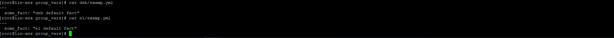

<h1>
Домашнее задание к занятию "08.01 Введение в Ansible"
</h1>

<h3>Подготовка к выполнению
</h3>
<h3>Основная часть</h3>

 - Попробуйте запустить playbook на окружении из test.yml, зафиксируйте какое значение имеет факт some_fact для указанного хоста при выполнении playbook'a.

 - Найдите файл с переменными (group_vars) в котором задаётся найденное в первом пункте значение и поменяйте его на 'all default fact'.

   

 - Воспользуйтесь подготовленным (используется docker) или создайте собственное окружение для проведения дальнейших испытаний.

 - Проведите запуск playbook на окружении из prod.yml. Зафиксируйте полученные значения some_fact для каждого из managed host.
   

 - Добавьте факты в group_vars каждой из групп хостов так, чтобы для some_fact получились следующие значения: для deb - 'deb default fact', для el - 'el default fact'.
   

 - Повторите запуск playbook на окружении prod.yml. Убедитесь, что выдаются корректные значения для всех хостов.
   

 - При помощи ansible-vault зашифруйте факты в group_vars/deb и group_vars/el с паролем netology.
   

 - Запустите playbook на окружении prod.yml. При запуске ansible должен запросить у вас пароль. Убедитесь в работоспособности.
   

 - Посмотрите при помощи ansible-doc список плагинов для подключения. Выберите подходящий для работы на control node.

   Local
 - В prod.yml добавьте новую группу хостов с именем local, в ней разместите localhost с необходимым типом подключения.
   
 - Запустите playbook на окружении prod.yml. При запуске ansible должен запросить у вас пароль. Убедитесь что факты some_fact для каждого из хостов определены из верных group_vars.
   
 - Заполните README.md ответами на вопросы. Сделайте git push в ветку master. В ответе отправьте ссылку на ваш открытый репозиторий с изменённым playbook и заполненным README.md.

